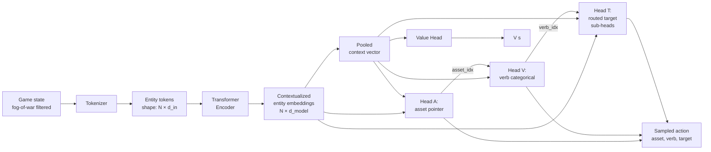
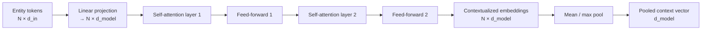
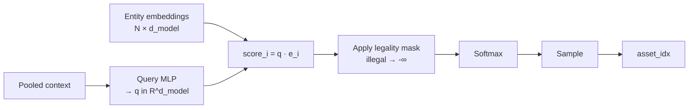
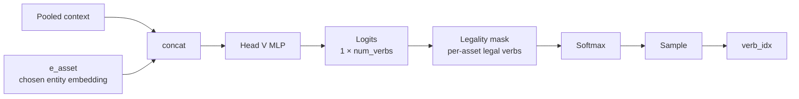
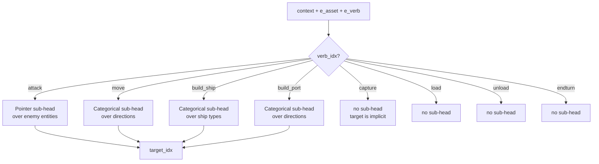
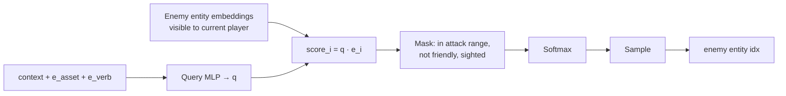
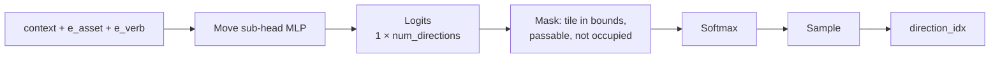
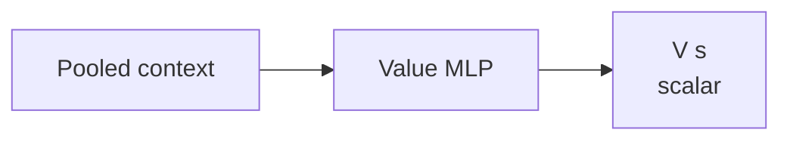
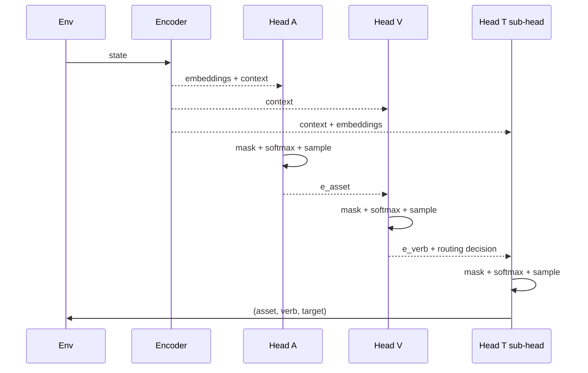

# Policy Network Architecture

This document describes the policy network architecture for the battleboats RL agent. The design targets two properties that the game demands:

1. **Variable-cardinality state and action space.** Players gain and lose ships over the course of a game; the number of entities is not fixed.
2. **Structured actions with joint legality constraints.** An action is a `(asset, verb, target)` triple where the legality of each factor depends on the prefix.

The architecture is a **transformer encoder** feeding into an **autoregressive policy** with three heads (`A`, `V`, `T`) plus a value head.

---

## 1. High-level data flow



- **Encoder** turns shallow per-entity feature vectors into contextualized embeddings — each output token now incorporates information from every other token in the set.
- **Heads** consume the embeddings (and a pooled context summary) to produce one action factor each.
- **Autoregressive plumbing**: each head's input includes the *sampled* outputs of upstream heads, not just the shared context.

---

## 2. Encoder

### Inputs

The encoder receives a **set of entity tokens**. Every ship, port, and sighted enemy is one token. Token feature vectors share a unified schema (with zeroed fields for inapplicable attributes):

| Field | Description |
| --- | --- |
| `type one-hot` | ship type / port / enemy sighting |
| `position` | normalized (x, y) on the map |
| `owner indicator` | friendly / enemy / neutral |
| `stats` | speed, vision, scouting, range, strength (0 for non-ships) |
| `ship state` | cargo, has_attacked, tiles_moved (0 for non-ships) |
| `port state` | stockpile, is_home (0 for non-ports) |
| `sighting state` | freshness, staleness (0 for friendlies) |

A small linear projection lifts each raw feature vector to dimension `d_model`.

### Mechanism



Self-attention is **bidirectional and parallel** — every token attends to every other token simultaneously. Position in the token sequence carries no meaning; entities are a *set*, not a sequence. The encoder is permutation-invariant by design (no positional encodings on the entity axis).

### Outputs

- **Per-entity embeddings** of shape `(N, d_model)` — preserved for use by pointer heads.
- **Pooled context vector** of shape `(d_model,)` — a global summary, fed to the categorical heads and the value head.

---

## 3. Head A — Asset selection (pointer head)

**Job:** choose which of my entities will act this step.

**Mechanism:** pointer head — a learned query vector is compared against each entity embedding via dot product, producing a score per entity.



**Legality mask:** entity `i` is selectable iff
- entity belongs to current player, AND
- entity has at least one legal verb available.

**Variable cardinality:** the head's output dimension equals the number of entity tokens currently in the encoder's output. No fixed cap, no padding.

---

## 4. Head V — Verb selection (categorical head)

**Job:** choose what kind of action the selected asset will perform.

**Mechanism:** standard fixed-width categorical head over the global verb set:

```
{move, attack, build_ship, build_port, capture, load, unload, endturn}
```



**Input plumbing:** Head V receives both the global context and the embedding of the asset chosen by Head A. This is the **prefix-feeding** that makes the head's logits depend on *which* asset was selected, not just the global state.

**Legality mask:** per-asset query — `legal_verbs(asset_id, game_state)`. A carrier that has already attacked this turn has `attack` masked; a ship with no cargo has `unload` masked; etc.

**No pointer needed:** the verb set is fixed and small (~8 options). Pointer heads only pay off for variable-cardinality outputs.

---

## 5. Head T — Target selection (routed sub-heads)

**Job:** choose the specific target for the action.

**The problem:** target type changes per verb.

| Verb | Target type | Sub-head type |
| --- | --- | --- |
| `attack` | enemy entity (variable) | pointer over visible enemies in range |
| `move` | direction (4 or 8 fixed) | categorical |
| `build_ship` | ship type (small fixed set) | categorical |
| `build_port` | direction (4 or 8 fixed) | categorical |
| `capture` | adjacent port (implicit) | — |
| `load` / `unload` | adjacent port (implicit) | — |
| `endturn` | none | — |

**Pattern: route by verb.** A family of specialized sub-heads; the verb sampled at Head V picks which sub-head fires.



### 5a. Attack sub-head (pointer)



**Fog-of-war discipline:** the candidate set is *only* enemies the current player has a sighting of. Enemies not in sightings do not appear in the encoder's input at all, so they cannot be pointed to even by accident.

### 5b. Move sub-head (categorical)



### Other categorical sub-heads

Same shape as the move sub-head, over different fixed-size domains (ship type, build direction, etc.).

---

## 6. Value head

**Job:** estimate `V(s)` — the expected return from the current state. Used by PPO for advantage estimation.



The value head is **not autoregressive**. It sees only the pooled context — never the sampled action prefix — because it predicts the value of the *state*, not the value of a particular action. (Action-value estimation `Q(s, a)` is a different quantity; PPO uses `V(s)` for the baseline.)

---

## 7. Sampling — autoregressive at inference, parallel at training

**Inference (rollout):** strictly sequential.



Each head waits for the upstream sample. Three sequential forward passes per action.

**Training:** the prefix `(asset_idx, verb_idx, target_idx)` was already sampled and stored during rollout. Forward-pass through all three heads in parallel using the stored prefix. No waiting.

**Joint log-probability** of a sampled action:

```
log π(a, v, t | s) = log π(a | s) + log π(v | s, a) + log π(t | s, a, v)
```

PPO's policy loss uses this sum. Easy to mis-bookkeep — worth a unit test.

---

## 8. Worked example — one player's turn

### Setup

Player 1's state at turn 12:

| Entity | Type | Position | State |
| --- | --- | --- | --- |
| `friend_1` | aircraft carrier | (5, 5) | full health, has not attacked, can move |
| `friend_2` | destroyer | (6, 5) | full health, has not attacked, can move |
| `home_port` | port | (0, 0) | friendly home port |

Player 1's sightings:

| Sighted | Type | Position | Freshness |
| --- | --- | --- | --- |
| `enemy_1` | destroyer | (7, 5) | sighted this turn |

Encoder input: **4 tokens** — `friend_1`, `friend_2`, `home_port`, `enemy_1`.
Encoder output: 4 contextualized embeddings + pooled context vector.

### Action 1 — carrier moves east

**Head A.** Mask: friendlies with legal moves available. Candidates = `{friend_1, friend_2, home_port}` (port has `build_ship` legal). The policy sampled `asset_idx = friend_1`.

**Head V.** Input: `context + e_friend_1`. Mask: legal verbs for the carrier = `{move, attack, endturn}` (no cargo → load/unload masked; not adjacent to enemy port → capture masked; carrier doesn't build → build_* masked). Sampled `verb_idx = move`.

**Head T (routed: move sub-head).** Input: `context + e_friend_1 + e_move`. Mask: directions to in-bounds, passable, unoccupied tiles. Sampled `direction_idx = east`.

**Action emitted:** `(friend_1, move, east)`. Engine applies it. Carrier now at (6, 5)... wait, that tile is occupied by friend_2.

In practice the legality mask would have ruled out `east` because the tile is occupied. Suppose instead the network sampled `direction_idx = north` and the carrier moves to (5, 4). Engine updates state.

### Action 2 — destroyer attacks enemy

After the move, the player's turn continues (`endturn` was not the verb chosen). Re-encode: the new state has the carrier at its new position. Run the heads again.

**Head A.** Mask: friendlies with legal moves available. Sampled `asset_idx = friend_2`.

**Head V.** Input: `context + e_friend_2`. Legal verbs for the destroyer at (6, 5) with `enemy_1` at (7, 5), in range = `{move, attack, endturn}`. Sampled `verb_idx = attack`.

**Head T (routed: attack pointer sub-head).** Input: `context + e_friend_2 + e_attack`. Candidate set: visible enemies in attack range of `friend_2`. Just one candidate this turn: `enemy_1`. Sampled `enemy_idx = enemy_1`.

**Action emitted:** `(friend_2, attack, enemy_1)`. Engine resolves damage.

### Action 3 — end turn

Re-encode after the attack. Run heads again.

**Head A.** Suppose the destroyer used its attack and the carrier already moved; both are now action-exhausted. The home port has `build_ship` legal but the policy decides to save resources. The asset mask might still allow the port (as a way to issue `endturn`), or there's a convention where Head V's `endturn` is selectable from any asset.

(Convention worth deciding: which entity "owns" the endturn verb? Cleanest is to allow `endturn` legal under any asset. Alternative: dedicate a sentinel "no-asset" token.)

**Head V.** Sampled `verb_idx = endturn`.

**Head T.** Skipped — `endturn` has no target sub-head.

**Action emitted:** `(any, endturn, —)`. Engine flips current player; the opponent's turn begins.

### What the encoder did, in one sentence

It took 4 raw entity descriptions and produced 4 embeddings rich enough that:
- the asset-pointer head could ask "which of these is best to act with right now?",
- the verb head could ask "given this asset, what should it do?",
- the attack sub-head could ask "given this destroyer attacking, who's the right target?",

all by linear projections and dot products against the embeddings. The work of *understanding the board state* lives in the encoder; the heads are thin selectors on top.

---

## 9. Summary of design choices

| Choice | Rationale |
| --- | --- |
| Transformer encoder | Permutation-invariant set processing; produces per-entity embeddings needed for pointer heads. |
| Autoregressive heads | Decomposes the joint action distribution; enables tractable per-step legality masking. |
| Pointer head for Head A | No fixed cap on entity count; head output size adapts to the current board. |
| Categorical for Head V | Verb set is small and fixed; pointer machinery would be overkill. |
| Routed sub-heads for Head T | Target type is heterogeneous per verb; each sub-head matches its target's natural shape. |
| Mask before softmax (`-∞`) | Correct gradient handling; illegal actions receive zero probability and zero gradient. |
| Prefix-feeding (chosen embedding, not logits) | Conditions downstream heads on the actual sampled choice; correct factorization of the joint distribution; enables per-step legality queries. |
| Shared encoder, separate heads | Heavy representation learning is shared; thin task-specific projections branch off. |
| Value head non-autoregressive | `V(s)` is a property of the state, not of a chosen action. |

---

## 10. What this document does *not* cover

Deferred to later docs:

- **Observation construction** — how the engine state is sliced and filtered into per-player tokens (fog-of-war discipline).
- **Reward shaping** — terminal-only vs dense intermediate rewards.
- **PPO loop** — rollouts, GAE, clipping, entropy bonus, value loss, self-play matchmaking.
- **Concrete hyperparameters** — `d_model`, head widths, attention heads, layer counts.
- **MVP baseline** — flat-MLP encoder + factored MLP heads with a generous entity cap, as a simpler reference architecture to debug PPO against before adopting the full transformer + pointer-head stack.
